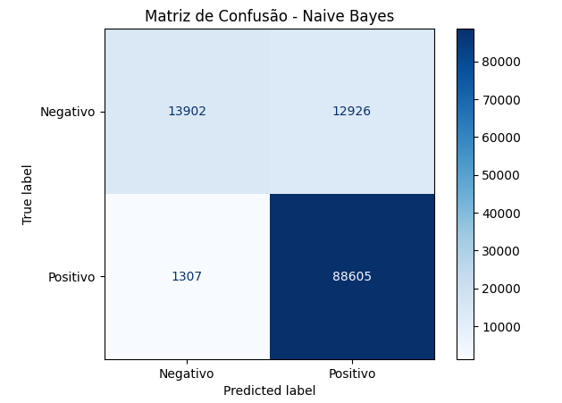

# 🛒 Análise de Sentimento - Amazon Reviews 2023

## 📌 Visão Geral

Este projeto aplica técnicas de **Processamento de Linguagem Natural (NLP)** e **Machine Learning** para classificar avaliações de produtos da Amazon. O objetivo é prever automaticamente se um comentário é **Positivo** ou **Negativo** com base apenas no texto escrito pelo usuário.

O projeto compara dois algoritmos clássicos: **Naive Bayes** (como baseline) e **Regressão Logística**, demonstrando como o pré-processamento correto e a escolha do modelo impactam a métrica final.

---

## 🗂️ O Dataset

Foi utilizada a base de dados **Amazon Reviews 2023**, focando apenas em compras verificadas (*Verified Purchases*) para garantir a qualidade da informação.

* **Entrada:** Texto do review (`text`) e Título (`title`).
* **Target (Sentimento):**
    * 👍 **Positivo (1):** Notas 4 e 5.
    * 👎 **Negativo (0):** Notas 1 e 2.
    * *Notas 3 foram descartadas por ambiguidade.*

---

## ⚙️ Pipeline de NLP

Antes da modelagem, o texto bruto passou por um tratamento rigoroso para reduzir ruídos:

1.  **Limpeza (Regex):** Remoção de pontuações, números e tags HTML.
2.  **Normalização:** Conversão para minúsculas (lowercase).
3.  **Stopwords:** Remoção de palavras comuns (ex: "the", "is", "and") usando NLTK.
4.  **Lematização:** Redução das palavras à sua raiz linguística (ex: "better" -> "good").
5.  **Vetorização (TF-IDF):** Transformação do texto em vetores numéricos ponderados pela frequência inversa nos documentos.

## 📊 Análise Exploratória (EDA)

Investigamos se o **tamanho do texto** influenciava o sentimento.

**Insights:**
* **Desbalanceamento:** O gráfico mostra um volume muito maior de avaliações positivas (verde) em relação às negativas (azul), o que é comum em e-commerce.
* **Padrão de Escrita:** A distribuição é similar para ambos os sentimentos. A maioria dos usuários escreve textos curtos (cauda longa à direita), indicando que o tamanho do review não é, isoladamente, um bom previsor do sentimento.

---

## 🤖 Modelagem e Resultados

Foram testados dois modelos. O **Naive Bayes** serviu como linha de base (baseline) para comparação com a **Regressão Logística**.

### 1. Baseline: Multinomial Naive Bayes
O modelo obteve uma acurácia de **87.8%**. Abaixo, vemos a matriz de confusão deste modelo:

> *Nota-se que, apesar de acertar bem os positivos (88k acertos), o modelo confunde uma quantidade considerável de negativos como positivos (Falsos Positivos).*

### 2. Modelo Final: Logistic Regression
A Regressão Logística superou o baseline, lidando melhor com a complexidade dos dados e o desbalanceamento das classes.

| Modelo | Acurácia | F1-Score (Negativo) | F1-Score (Positivo) |
| :--- | :---: | :---: | :---: |
| Naive Bayes | 87.81% | 0.66 | 0.93 |
| **Logistic Regression** | **91.46%** | **0.80** | **0.95** |

Conclusão: A Regressão Logística aumentou a capacidade de detecção da classe minoritária (reviews negativos), subindo o F1-Score de 0.66 para 0.80, provando ser a solução mais robusta para este problema.

👨‍💻 Autor

Alexander Lira Data Analyst | Python | Machine Learning
